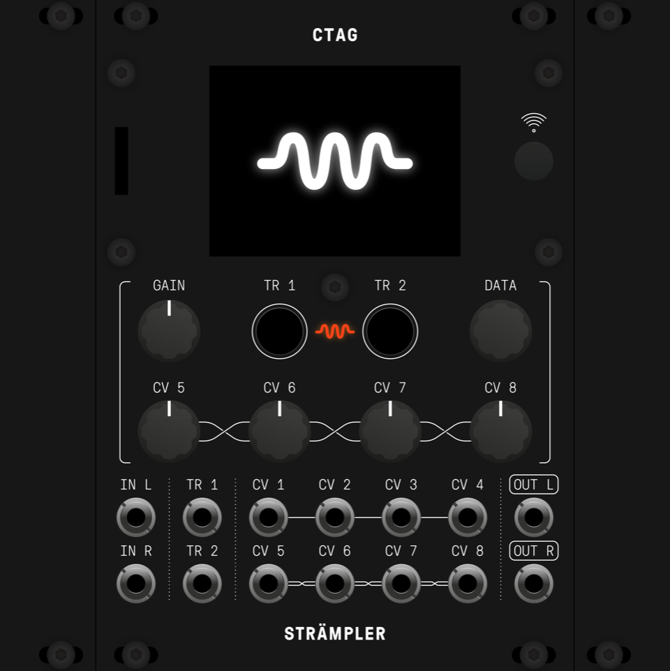

# Hardware
This directory contains two alternative hardware designs, the original CTAG and a beautiful smaller form factor redesign by [Antumbra](http://www.antumbra.eu/).
Apply a "git submodule update --init --recursive".

## CTAG 
Designs are in KiCad Format. Original hardware repo added through git submodule.

## Antumbra

Designs are in Eagle Cad Format.

[BOM](https://docs.google.com/spreadsheets/d/16I0Fnxrp7fq1aB0nhNF5OuEwzjhC1HZl9R4_WuAPDM4)

[Mouser cart](https://www.mouser.com/ProjectManager/ProjectDetail.aspx?AccessID=9c1a090daf)